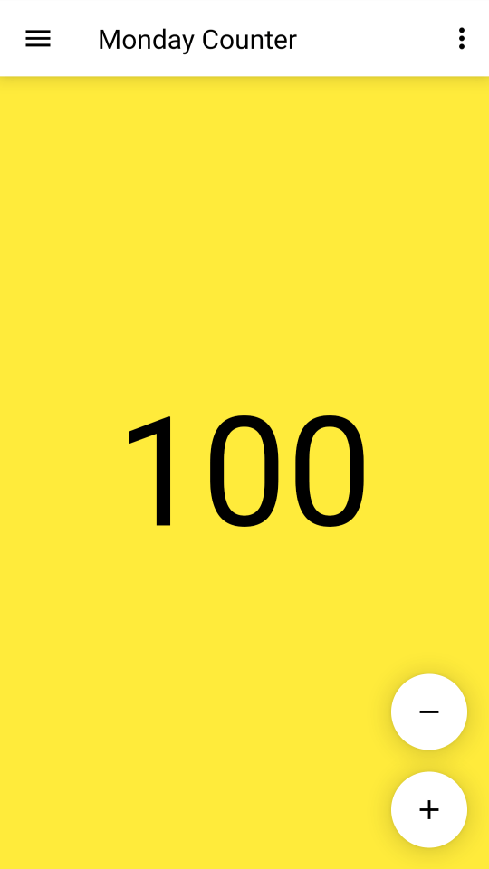
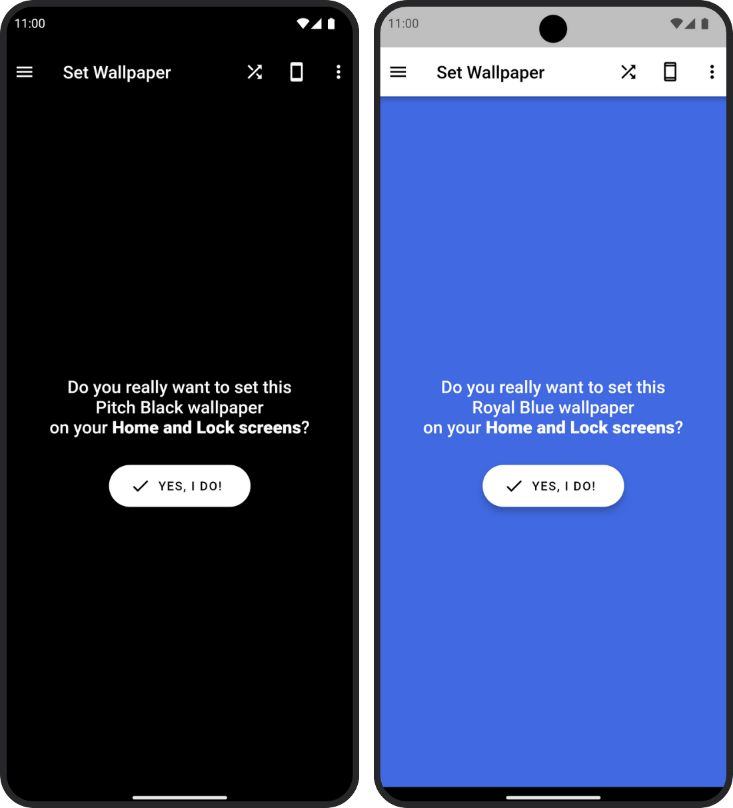

# Weekday Counters

Weekday Counters is an easy-to-use Hello World counter app for Android. It gives you a different counter for each day of the week: Monday, Tuesday, Wednesday, Thursday, Friday, Saturday, Sunday. You can increment or decrement the counter, reset its value back to zero, or share it by email, messengers, or in social networks.

"Hello World" programs are pretty famous, even if all they do is write "Hello World!" on the screen. When learning a new programming language or platform, starting with such a simple program has become a tradition.

Weekday Counters is built with [Flutter](https://flutter.dev), an open source framework for building beautiful, natively compiled, multi-platform applications from a single codebase.

## Screenshot

## Try Weekday Counters

* **On Android:** Get it from [GitHub Releases](https://github.com/HelloTecdrop/weekday_counters/releases).
* **On any platform:** [Run the web app](https://weekdaycounters.tecdrop.com/) and/or install it from your browser on Android, ChromeOS, iOS, Linux, macOS, Windows, etc.

## Listed on

**[It's All Widgets!](https://itsallwidgets.com/weekday-counters)**  
An open list of apps built with Flutter

## Contributing

Thank you for contributing! Weekday Counters is designed to be as simple and useless as possible, but you can still help with:

* testing and reporting bugs
* creating a nice icon to replace the [current one](web/icons/Icon-512.png)

## Support Us

Weekday Counters is a free Hello World app, and we love creating and sharing projects like this, and other useful [free apps](https://www.tecdrop.com/apps/free/) with the community. If you want to support us, try our Pro apps:

| Our Pro Apps | [Pitch Black Wallpaper Pro](https://www.tecdrop.com/pitchblackwallpaperpro/) | [RGB Color Wallpaper Pro](https://www.tecdrop.com/rgbcolorwallpaperpro/) |
| ------------ | ------------------------- | --- |
|  | <li>Pitch black & dark wallpapers</li><li>AI-generated wallpapers</li><li>Enhances battery life</li><li>Reduces eyestrain</li> | <li>Set any color as wallpaper</li><li>Endless color options, built-in & custom</li><li>Reduce visual clutter</li><li>Enhanced device aesthetics</li> |

## License

Weekday Counters is released under the [MIT License](/LICENSE).
